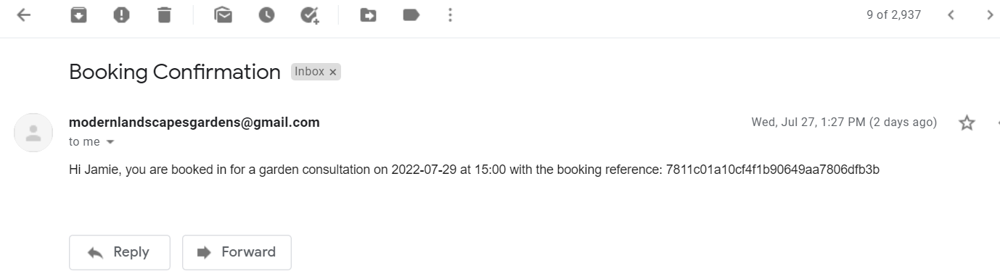

<h1 align="center">Modern Landscapes</h1>

[View the live project here](https://modern-landscapes.herokuapp.com/)

Modern Landscapes is a gardening and landscaping company that have been operating in the greater Dublin area for over 25 years. For that length of time they have never had a website, relying solely on word-of-mouth marketing to generate business. 

The new Modern Landscapes website allows users to contact Modern Landscapes directly, make bookings as well as changing or deleting those bookings with the booking reference provided via email.

The admin users can view and manage bookings as well as contact forms filled out.


## Index – Table of Contents
* [User Experience (UX)](#user-experience-ux) 
* [Features](#features)
* [Design](#design)
* [Planning](#planning)
* [Testing](#testing)
* [Deployment](#deployment)
* [Technologies Used](#technologies-used)
* [Credits](#credits)


## User Experience (UX)

### User stories :

- As a **user** I can **click on a link** so that **it brings me to a new page, such as the calendar booking page **
- As a **user** I can **fill out the contact form** so that **I can communicate with Modern Landscapes**
- As a **user** I can **select a date on the calendar** so that **I can make a booking**
- As a **user** I can **get a booking ID** so that **make changes to my booking or delete my booking**
- As a **user** I can **edit my booking** so that **I can select a more suitable time and/or day**
- As a **user** I can **delete an existing booking** so that **I do not waste my time or Modern Landscapes' time**
- As a **user** I can **update an existing booking** so that **I can change a booking**
- As a **user** I can **view a booking calendar** so that **I can have an overview of dates that are available**

- As an **admin** I can **view messages sent via the admin panel** so that **I can view messages sent and communicate with users**
- As an **admin** I can **view bookings** so that **I can prepare a work schedule**#
- As an **admin** I can **delete** so that **change a person's booking**
- As an **admin** I can **delete** so that **customers are not dissapointed**


## Features

### Existing Features

- Navigation Bar

The navigation bar features on every page of the website, giving a consistent feel to the website. The navigation bar features the logo to the left. It also features three links and a button, for home, our work, contact with the button being book now.

When on a smaller screen the navigation links become a 'burger' style icon, when clicked it will show all links with the "book now" button becoming a link.


When a staff account is logged in a nav item named "Admin" will appear. When clicked this will bring the staff member to the admin page. From the admin page a staff member can view a contact message and reply via email. They can also add, edit and delete any bookings.


- Home Page/ Hero Image

The home screen features a background image of a large bush and the owner of Modern Landscapes. Accompanying that is a text layover with a title, subtext and a clear call to action with a book now button below. 


- Our Work Banner

The following section features a small amount of text to the left and a large gold button to the right contains a link to the our work/ gallery page.


- Benefits Section

This section of the Modern Landscapes website features three of the key benefits you get when working with Modern Landscapes. The first benefit stated is experience, as Modern Landscapes have been operating for 25 years+, that is a great benefit. Second is outlining their terrific customer service and finally, the quality of work they provide and materials they source.


- Testimonials Section

The next section contains testimonials from three select customers of Modern Landscapes, Joe, Mary and John. This section features a quote on the left and then a circular image of each person. This layout alternates as the user goes down the website. When viewed on mobile devices the images will be hidden.


- Book Now CTA 

The bottom of the home page features another section very similar to the our work banner, this is once again a call to action to entice the user to book a garden consultation. Like the our work banner the text is to the left and the button is to the right. When viewed on mobile devices the text and button will appear above one another.


- Footer

The footer is the last feature of the home page. This contains site links to the left, social links in the middle and the logo to the right. When viewed on a mobile the site links are hidden and the social links stack on top of the logo.


- Our Work Page

The Our Work page features a gallery of past completed jobs


- Contact Page

The Contact page features a full contact form that displays a form. To fill this out the user will need to provide their name, email address, phone number and message. All feature checks for errors and empty fields. The user is then redirected to the contact page with an alert message saying "Thanks for getting in touch, ' + name + '. A member of the Modern Landscapes team will get back to you shortly."


- Booking Home

This page is the main page for booking. This page features two buttons, the first to edit an existing booking and the second to make a new booking. 


- Booking Form

This is the main booking form. The user is required to provide their name, email address, phone number. They then have to select a date that suits them and a time. All fields are validated for errors and blanks. Upon clicking submit if the form is valid the user will receive an email confirmation.


- Email

Here we have the email that a user will receive if they fill out the form correctly. The email greets them by their name. It then lists the date and time they have selected. The email will also contain the booking reference associated with their booking. This booking reference can be used to edit or cancel their booking.




- Edit Booking Page

From the email the user will have the booking reference, this can be entered in edit booking page. If a reference is not found an error will be thrown, if it is the booking will appear with an edit and delete button.


- Delete Booking

The final feature is the delete booking feature. If cancel is clicked on the found booking a modal will pop up asking the user for confirmation of their intention to delete.


### Future Features to be Implemented

- Improve Email

In future I would like to display a nicer formatted HTML email message.

- Admin Block Dates

A future element that I would like implemented would be for an admin to be able to block out days/ times. This unfortunately fell out of the scope of this project.

- Combination of Date Selector and Time Selector

Another feature I would like to see implemented is the combination of the date and time field to provide a cleaner user experience.

- Article Page for Our Work

I believe that instead of a gallery page, a page where admin and worker accounts would be able to post articles containing not just the finished work but the start and progress pictures would serve Modern Landscapes better. This however fell out of the scope.


## Planning

### Strategy

The client's goal was to generate leads through the booking of garden consultations through the website. To achieve this goal I made the decision to not have user accounts just admin accounts. The user will receive an email with a booking reference that they can use to edit or delete their booking. This is due to the fact that users would be put off having to sign up for a website they were likely only going to use once. With two accounts for admin and workers. Workers can not delete or edit a booking or contact form.

Users would also have an easy way to contact Modern Landscapes with the contact form.


### Scope
Myself and the client discussed the scope at length. I gave Modern Lanscapes an idea of what was possible within the timeframe of this project. A home page, gallery, contact and booking page that upon completion would email a booking reference to the user to make changes or cancel their booking. 

An article page fell out of this scope.

### Structure

This project contained four applications.
- Home - Contains home page.
- Work - Contains our work/ gallery.
- Contact - Provides a contact form page for users to submit their queries.
- Booking - Provides a booking form that takes the user's name, email address, phone number, chosen date and chosen time. A booking id is then generated that can be used to edit and delete.

**Model Diagrams**

Firstly, the booking model consists of a booking_id as the primary key, then five other fields consisting of name as a CharField, email as an EmailField, phone as a custom PhoneNumberField, date_choice as a DateField and time_choice as a CharField.

Next is the contact model. This consists of name as CharField, email as an EmailField, phone as a CharField and message as a TextField.


### Skeleton

I have included wireframes of the home page, contact page and booking page. I chose to leave out the our work/ gallery page as that was very straight forward.


### Surface

**Colours**

The colour scheme used in this project reflect the logo and main benefits section, I have also incorporated a gold/yellow colour as Modern Landscapes previously had clothing made with a similar colour.


**Typography**

For typography I decided to stick with the Bootstrap fonts as I liked them.

**Imagery**

I used some stock imagery for the our work/ gallery page. I did the same for the headshots in the testimonials section. The three benefits images have been created by Lauren Tarpey. The hero image is an picture that I took.


## Testing

 ### Valdator Testing

 W3 HTML Validator checks have been performed on the below page, finding no issues.
 - Home Page
 - Our Work Page
 - Contact Page
 - Booking Page
 - Booking Home Page
 - Booking Edit Page
 - Booking Form Page
 - Base.html

 W3 CSS Validator found no errors.

 PEP8 Validatior testing found no issues on the below files.
- Home - views.py
- Home - urls.py
- Our Work - view.py 
- Our Work - urls.py 
- Contact - models.py
- Contact - views.py
- Contact - admin.py
- Contact - urls.py
- Booking - forms.py
- Booking - models.py
- Booking - views.py
- Booking - admin.py
- Booking - urls.py
- Booking - test_views.py
- Booking - test_models.py
- Booking - test_fields.py

I am unable to use Google's lighthouse to test my website, as it is currently not working and if I get it to work I will not be making any more pushes for fear of it breaking, again.

### Issues and Bugs

I have faced major issues deploying to Heroku. Initially, only my Django Admin was rendering unstyled so I contacted Tutor support. I deleted the entire contents of my Cloudinary twice and it made no difference. The tutor could not resolve the issue so I had to wait for the next day.

The following day, all my static files were now not rendering. Including my website. After hours of no resolution I asked would creating a new Cloudinary account, I did that and it worked! For the first two pushes... then back to how it was at the beginning of the day.

Worse yet, my static files aren't loading in my local Gitpod environment. There is a lot more testing and minor tweaks that I would have liked to have made but I plan to create a new Cloudinary account and if that works I will have to leave that to be graded on.

### Automated Testing

I conducted 20 tests, listed below using Django TestCase.

- Tested if a valid booking form would process.
- Tested if name was left out of booking would that raise an error.
- Tested if email address was incorrect would the booking form raise an error.
- Tested if phone number was incorrect would the booking form raise an error.
- Tested if today's date or a past date would the booking form raise an error.
- Tested if a time was selected that was not in the time select would the booking form raise an error.
- Tested if a mistyped date was input would the booking form raise an error.
- Tested if valid name was entered would test pass.
- Tested if valid email was entered would test pass.
- Tested if valid phone was entered would test pass.
- Tested if valid date choice was entered would test pass.
- Tested if valid time choice was entered would test pass.
- Tested if home page would render.
- Tested if booking page would render.
- Tested if booking form would render.
- Tested if booking edit page would render.
- Tested if contact page would render.
- Tested if our work/ gallery page would render.
- Tested if blank name would raise error message.
- Tested if incorrect email would raise error message.
- Tested if incorrect phone number would raise error message.
- Tested if email would send locally.

## Manual Testing

The following buttons and links were tested under the requirements that they can be clicked, redirect user to correct page and a hover effect is working.


## Responsive Testing

The website is responsive on all screen types. The content that had to be changed to be responsive were:

- Navigation Bar - When screen becomes smaller it was necessary to create a 'burger' button so that links go into this drop down menu and the "Book Now" button becomes a link.
- Our Work & Book Now Banners - These banners contained text and a button displaying alongside each other. This had to be changed to display one on top of each other, extra padding was necessary then for the buttons.
- Benefits Section - The benefits section on small screens is forced to appear as a column now.
- Testimonials - At a smaller screen size I have hidden the images, just leaving the text content.
- Footer - At a certain breakpoint, the site links are hidden. At a further breakpoint, the social links display above the logo.
- Booking Page - On smaller screens the edit button and new booking button display vertically.


## Deployment

### Set up Github Repo and Gitpod Workspace

1. Create a repository in Github – using the Code Institute Gitpod Full template.

2.	Click on the green Gitpod button to load the repository workspace in Gitpod.


### Install Django and Supporting Libraries

1.	Install Django and Gunicorn Heroku
``` pip3 install Django==3.2 gunicorn ```

2.	Install PostgreSQL.
``` pip3 install dj_database_url psycopg2 ```

3. -	Install library for Cloudinary.
``` : pip3 install dj3-cloudinary-storage ```

4. Create the requirements.txt file.
``` pip3 freeze --local > requirements.txt ```


### Create a project directory and project applications

1. Create a project directory 
``` django-admin startproject project_name  ```
(This creates a root directory for the project with a settings.py, manage.py, urls.py, etc.

2.	Create project apps.
``` python3 manage.py startapp application_name  ```

3. Add the app to the settings.py file of the root directory.
Add to the bottom of 'INSTALLED_APPS', e.g "booking".


### Migrate changes to the database

1. Plan migrations first.
``` python3 manage.py migrate -–plan   ```

2. Run migrations.
``` python3 manage.py migrate  ```

3. Plan make migrations.
``` python3 manage.py makemigrations --dry-run ```

4. Run migrations.
``` python3 manage.py makemigrations ```

5. Test if working
Run a local server.
``` python3 manage.py runserver ```
Open up the browser, it should open up a screen that displays that the “install worked successfully”


### Connect the Gitpod Terminal to Heroku

1. Open up Heroku login command from the gitpod terminal - type in the following into the gitpod terminal:
``` heroku login –i ```

2.	Login in With Your Heroku Email and Password
Create an app on heroku for the EU region – type the following into the gitpod terminal:

``` Heroku create app_name –region=eu ```


### Connect a Postgres Database to the Heroku App

1. Open app in Heroku
2. Click on the ‘Resources’ tab
- In the ‘add-ons’ box search for ‘Heroku Postgres’ and select it.
- A pop-up box will appear to confirm the installation of heroku postgres in your app – select ‘submit order form’. Heroku Postgres will now appear in the ‘add-ons’ list.
3.	Click on the ‘Settings’ tab
- Scroll to ‘Config Vars’ then click on ‘Reveal Config Vars’ to retrieve our database URL
- Next to the config var called ‘DATABASE_URL’ copy the postgres URL in order to add into our project in gitpod as per steps below.


### Create and Set Up an env.py File

1. Create a file called 'env.py' in your top level directory.
2. Open the env file amd type this code: ``` import os
os.environ["DATABASE_URL"] = "Paste in Heroku DATABASE_URL Link"
os.environ["SECRET_KEY"] = "Make up your own randomSecretKey" ```


### Update Config Vars in Heroku App With Secret Key

1. In your Heroku app, go to Settings.
2. Click reveal config vars.
3. Type SECRET_KEY in keys section, amd paste your secret key from Gitpod.
4. Click add and youre done.


### Update Root App With Secret Key

1. Open settings.py, find from pathlib import Path.
2. Paste code below: ``` import os
import dj_database_url if os.path.isfile("env.py"):
import env ```
3. Update secret_key in settings.py to: ``` os.environ.get('SECRET_KEY') ```


### Connect the App to the Postgres Database

1. Open settings.py, find from DATABASES.
2. Highlight all of the section and comment it out.
3. Add a new ‘DATABASES’ section – as below: ``` DATABASES = {
'default': dj_database_url.parse(os.environ.get(‘DATABASE_URL’))
} ```

4. To test if working go to Heroku - Resources - Heroku Postgres, you should see zero rows and tables.
5. Type ``` python3 manage.py migrate ``` then refresh Heroku, you should see the database has populated.
6. Uncomment the previously commented database line of code and comment out the live database. 


###	Set up a Cloudinary Account and Link it to the Project

1. Create Cloudinary account
2. Navigate to API Envionment Variable.
3. In Gitpod, go to the env.py file and enter:

``` os.environ["CLOUDINARY_URL"] = "cloudinary://************************" ```

4. Copy the Cloudinary URL and add it to Heroku as a config var with the key name CLOUDINARY_URL.
5. Also add config vars, DISABLE_COLLECTSTATIC with a value of 1 and PORT with a value of 8000.


###	Add Cloudinary Libraries to the Project

1. Go to the settings.py in Gitpod.
2. In the ‘INSTALLED_APPS’ section install ‘cloudinary_storage’ and ‘cloudinary’ below and above ‘django.contrib.staticfiles’ 


### Instruct Django to use Cloudinary for static file storage

1. Go to setttings.py, find "STATIC_URL=’/static" and add this code below: ``` STATICFILES_STORAGE =
'cloudinary_storage.storage.StaticHashedCloudinaryStorage' STATICFILES_DIRS = [os.path.join(BASE_DIR, 'static')] STATIC_ROOT = os.path.join(BASE_DIR, 'staticfiles')

MEDIA_URL = '/media/'
DEFAULT_FILE_STORAGE = 'cloudinary_storage.storage.MediaCloudinaryStorage' ```


###	Instruct Django on Where Templates Will be Stored

1. Go to setttings.py, find "BASE_DIR" and add this code below:
``` TEMPLATES_DIR = os.path.join(BASE_DIR, 'templates') ```
2. Find "TEMPLATES" and change "DIRS" to "TEMPLATES_DIR"


### Set up Allowed Hosts

1. Go to setttings.py, find "ALLOWED_HOST" and add this code below:
``` ALLOWED_HOSTS = [‘project_name.herokuapp.com’, ‘localhost’] ```


### Create Static, Media and Templates Folders

1. In Gitpod, add folders static, media and templates to the top level.


### Create a Procfile

1. Again, in the top level directory create a file called "Procfile"
2. Open this file and add: ``` web: gunicorn project_name.wsgi ```


### Push Code to Github

1. git add .
2. git commit -m "meaningful message"
3. git push


### Deploying to Heroku

1. Follow previous instructions for pushing code to Github.
2. Go to the the Heroku app, find the "Deploy" tab.
3. Select "Heroku CLI"
4. Type ``` heroku login -i ```
5. Then tyoe ``` git push heroku main ```


### Final Deployment 

1. Open settings.py, set Debug to False.
2. Below Debug = False add this code: ``` X_FRAME_OPTIONS = ‘SAMEORIGIN’ ```
3. Uncomment production database and comment out the develpment database.
4. Follow previous instructions for pushing code to Github.
5. Note: DISABLE_COLLECTSTATIC has not been removed from my config vars as I am getting an etag error anytime I try to deploy with disable_collect static removed and the build fails. This is an issue that 2 tutors could not resolve.
6. Type ``` heroku login -i ```
7. Then tyoe ``` git push heroku main ```
8. Check app in Heroku to make sure all is working.


## Technologies Used

The languages used in this project are:
- HTML
- CSS
- Javascript
- Python

I used several frameworks, libraries and programs to create this website:
- Django
- Bootstrap v4.6
- Heroku Postgres
- SQLite
- Github
- Gitpod
- Heroku
- Cloudinary
- PhoneNumberField
- Moqups
- Balsamiq
- Photoshop
- PEP8 Online
- W3C Mark Up Validation
- W3C CSS Validaton
- Beautify


## Credits

### Resources
- Code Institute - Hello Django, I think therefore I blog, Python testing, Logout page.
- Stackoverflow - helped with testing, and having a datepicker on my booking form in particular.
- Codemy - Youtube channel helped a lot.
- Realpython.com - Helped with my understanding of auto testing.
- Bootstrap - helped with modal template and general troubleshooting.
- W3Schools - helped me with a lot of basic stuff I forgot.
- Youtube - I have watched countless Youtube videos to try and explain how to do what I was doing.

## Acknowledgments

- Credit to Lauren Tarpey for creating the images and logo used in this project.
- Thanks to my mentor, Brian Macharia, for his help during this project. His feedback has been very helpful.
